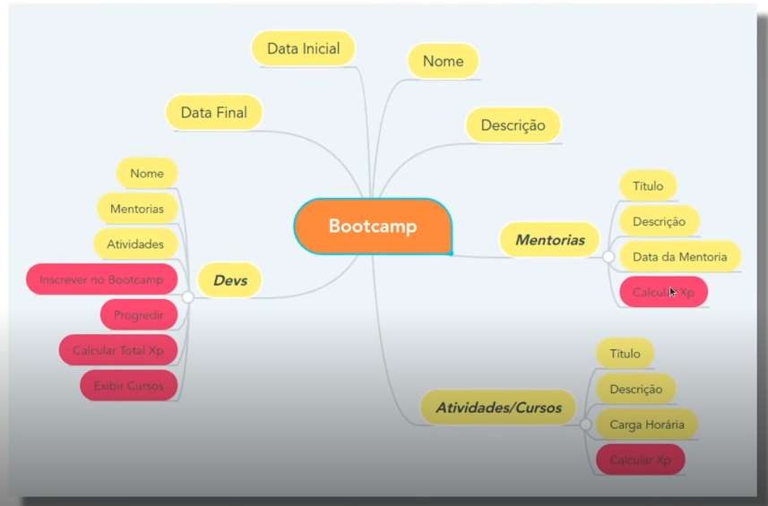

# Bootcamp POO

Desafio proprosto pela [DIO](https://www.dio.me) no módulo Programação Orientada a Objetos com Java no bootcamp Santader 2024 - Backend com Java.

## Descrição do Projeto

Criar um simples sistema de Bootcamp utilizando os conceitos de Programação Orientada a Objetos.

